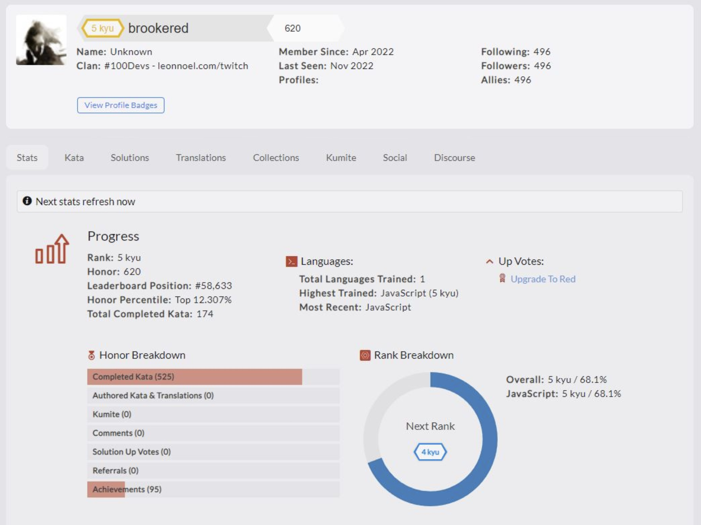

# Codewars Challenges - **[Visit Here](https://www.codewars.com/users/brookered)**

This repository consists of coding challenges (kata) found on Codewars, where I aim to push at least 3 solutions per week. I currently have completed 175+ challenges and am in the top 12.3% Honor percentile.

## How It's Made:
**Tech used:** 

## Optimizations
I attempt to write my solutions to be as efficient or simple as possible, but sometimes the code is written specifically to how the kata was set up. Solving the challenges also reveals more efficient or clever ways to solve them, which helps me learn how to better write solutions in the future.

## Lessons Learned:
Working on numerous kata has aided me to think of new ways to solve a problem, learn to better optimize my code, and most importantly it has encouraged me to consistently practice and improve my programming skills!
